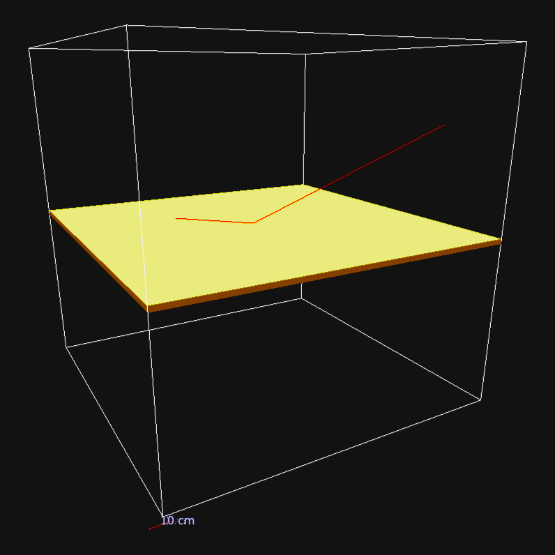

<p align="center">
 </a>
</p>

<h3 align="center">Geant4 Scattering Simulaton - CERN Summer Student Program 2023</h3>

<p align="center">
 </a>
 </a>
</p>

---

<p align="center"> A comprehensive flat scattering Geant4 simulation with angle, material, particle type, particle momentum, and plate thickness as parameters. Options for visualization or batches, with ROOT ntuple outputs. Analysis scripts produce histograms (both arrays and individual) of momentum and angle of reflected particles, and scatter plots with errors of the means and modes of the reflected angle distributions (with matplotlib).
    <br> 
</p>

## Table of Contents

- [Simulation](#simulation)
    - [Visualisation](#visualization)
    - [Batch](#batch)
- [Analysis](#analysis)
- [Additional Notes](#notes)
    - [Material Identification](#materialID)
- [Built Using](#built_using)
- [Authors](#authors)
- [Acknowledgements](#acknowledgements)

## Simulation <a name="simulation"></a>

### Visualization <a name="visualization"></a>
Visualization allows the user to interact with the simulation and observe visually how the simulation works.

To run the simulation in visualization mode, you must first make a build directory and compile the simulation. From the project directory, run the following commands:
```bash
mkdir build
cd build
cmake3 .. #(or cmake ..)
make
```
Alternatively, if you are using lxplus (at CERN), you can directly run the ```setup.sh``` bash script which builds and compiles the simulation script, while also sourcing an appropriate compiler and geant4 version:
```bash
bash setup.sh
```


Now that the simulation is compiled, you can run it directly with a command line argument:
```
./simulation [mac_file] [plate_material] [beam_angle] [beam_momentum] [beam_particle_type] [output_file] [output_dir] [visualization] [plate_thickness]
```
Parameters:
1. **mac_file**: The path to the mac file being used. For visualization, the prepared .mac file for visualization is mac/vis.mac.

2. **plate_material**: There are three plate materials: Copper (parameter 0), Glass (parameter 1), Gold-Plated Copper (parameter 2), and Gold (parameter 3)

3. **beam_angle**: The incident angle of the particles (in degrees). 0 degrees is perpendicular to the plate surface, 90 degrees is parallel with the plate surface.
4. **beam_momentum**: The incident momentum (in MeV) of the particles.

5. **beam_particle_type**: The beam particle type (e.g. mu-, mu+, e-, proton, etc).

6. **output_file**: The name of the output ROOT file (e.g. output.root).

7. **output_dir**: The path to the output file directory.

8. **visualization**: Enables (1) or disables (0) the visualization manager in the simulation. For visualization, always set to 1.

9. **plate_thickness**: *OPTIONAL* The thickness of the scattering plate (in mm). If no argument provided, the default thickness is 5 mm.

Once you have run this command line argument, a visualization will pop up. There may also be a number of tracks already visible, depending on whether or not this was specified in the mac/vis.mac file. In the visualization, you can further run the command 
```/run/beamOn N``` *in the visualization gui command line*, where ```N``` is the number of particles you want to run the simulation with. Old particle tracks will be removed, and the new ones will be displayed.

Moreover, there will be an output root file with event information saved (as specified in the command line parameters) for each run.


### Batch <a name="batch"></a>
>This is designed to be run on lxplus (CERN) with the HTCondor batch system, and output file transferring to EOS

The batch system allows users (specifically CERN users) to run large amounts of simulations and store the resulting output files in an appropriate location (such as the EOS system).

To successfully run a batch job of this simulation, there are a few things that need to be done:

1. Create an output directory in EOS where you want to save all of your batch outputs. Navigate to your EOS directory and run:
    ```bash
    mkdir general_data_directory
    cd general_data_directory
    mkdir batch_directory
    ```
    It may be useful to make a subdirectory specific to each batch you are running to categorize the output files, as seen in the sample code above.

2. Make a batch configuration file. This can be done manually or using the python script: ```make_config.py```. To do so manually, make a text (.txt) file with one configuration each line formatted as followed:
    ```txt
    output_directory_name1, angle1, momentum1, particle1, material1
    output_directory_name2, angle2, momentum2, particle2, material2
    .
    .
    .
    output_directory_nameN, angleN, momentumN, particleN, materialN
    ```
    Optionally, you can also add a thickness as a 6th parameter on each line. *Units: momentum in MeV/c, angle in degrees, thickness in mm.*

    Alternatively, one can use the ```make_config.py``` python script to do this automatically. In the script, adjust the parameters as seen below
    ```python
    # Constants
    #=====================================================
    FILE_NAME_EXTRA = 'extra_identifier_in_config_file' # Addition string for name of config file
    THICKNESS_BOOL = False # Whether or not the config file includes thickness as a parameter

    # Sample data for angles, momenta, particles, and material types (and thickness)
    #=====================================================
    OUTPUT = 'batch_directory' # Name of output directory (not including path) for the : 'output', 'angle_study', etc
    ANGLES = [20,40,60,80] # Incident Angles (deg)
    MOMENTA = [10,20,30] # Incident Momenta (MeV/c)
    PARTICLES = ['proton', 'e-'] # Incident Particle Type: 'e-', 'mu-', 'mu+', 'proton'
    MATERIALS = [0,1,2] # Material of Plate: 0 -> Copper, 1 -> Glass, 2 -> Gold Plated Copper, 3 -> Gold
    THICKNESS = 5 # Thickness of plate (mm)
    ```
    and run the script with ```python3 make_config.py```. This will produce a configuration file with all of the permutations of the parameters set above. *Hint: use ```np.linspace``` and ```range``` to simplify complicated ranges of momenta and angles*

3. Now that you have your configuration file with all of the combinations of parameters you intend on simulating, you can submit the batch to the grid. If you are using the default plate thickness (5mm), run the following command:
    ```bash
    condor_submit batch/batch.sub config=path_to_config_file
    ```
    where **path_to_config_file** is the path to the configuration file you intend on submitting.
    If you are running with a different thickness, run the following command:
    ```bash
    condor_submit batch/batch_thickness.sub config=path_to_config_file
    ```
    Both submission commands above will run with a default configuration run time allotment of 20 minutes (espresso), with a default .mac run file (run.mac) which runs 100 000 events per configuration, and will store the job logs and error files in the **Project/jobs** directory. Should you wish to change these, you can submit the batch with additional parameters:
    ```
    condor_submit batch/batch.sub config=path_to_config_file mac=path_to_mac_run_file flavour=name_of_flavour jobs=path_to_jobs_directory
    ```

    Find the available job 'flavours' at [here](https://batchdocs.web.cern.ch/local/submit.html).

    The general format of a run .mac file is:
    ```mac
    # Initialize Run
    /run/initialize

    # Run with N events
    /run/beamOn N
    ```
    Make additional .mac files as necessary with different event numbers ```N```, and add them to the **Project/mac** directory. For instance, see **Project/mac/run1000000.mac**.

Once these steps have been completed, the batch will be submitted and once completed, the outputs will be available in the specified batch output directory on the EOS system. Repeat these steps with different configuration files to submit further batches.

## Analysis <a name="analysis"></a>

In order to run analysis on simulated data, the primary thing to prepare is a configuration file. It should take the form of this sample configuration file:
```ini
[Setup]
# Number of Events (must agree with number of events in supplied data)
EVENTS = 1000000
# Cutoff number of reflected/transmitted events per configuration for adding to plots/analysis
EVENTS_CUT = 10
# Reflected particles (False), Transmitted particles (True)
TRANSMITTED_PARTICLES = False

[PlotSelection]
# Histograms of outgoing theta distributions
THETA_HISTOGRAMS = False
# Histograms of outgoing phi distributions
PHI_HISTOGRAMS = False
# Histograms of outgoing momentum distributions
MOMENTUM_HISTOGRAMS = False
# 2D histograms of outgoing theta vs outgoing momentum
CORRELATION_HISTOGRAM_THETA_MOMENTUM = False
# 2D histograms of outgoing theta vs outgoing phi
CORRELATION_HISTOGRAM_THETA_PHI = False

# Array of histograms of outgoing theta distributions
THETA_HISTOGRAM_ARRAY = False
# Array of histograms  of outgoing phi distributions
PHI_HISTOGRAM_ARRAY = False
# Array of histograms of outgoing momentum distributions
MOMENTUM_HISTOGRAM_ARRAY = False
# Array of 2d histograms of outgoing theta vs outgoing momentum
CORRELATION_HISTOGRAM_THETA_MOMENTUM_ARRAY = False
# Array of 2d histograms of outgoing theta vs outgoing phi
CORRELATION_HISTOGRAM_THETA_PHI_ARRAY = False

# Scatterplot of reflected, transmitted, decayed, absorbed events
REFLECTED_TRANSMITTED_DECAYED_SCATTER_PLOT = True

# Scatterplot of cutoff angles
CUTOFF_THETA_SCATTER_PLOT = False

# 2D Histogram of outgoing momenta  vs incident angle
HISTOGRAM_MOMENTA_INCIDENT_ANGLE = False

# Scatterplots of the mean and mode (with error) of the outgoing thetas
THETAS_SCATTER_PLOT = True
# Scatterplots of the mean and mode (with error) of the outgoing momenta
MOMENTUM_SCATTER_PLOT = False

[PlottingParameters]
# for MOMENTA and ANGLES, the format is start, stop, step
# or MATERIALS and PARTICLES, the format is input1, input2, input3, ... , inputN
MOMENTA = 10, 300, 10
ANGLES = 0, 87.5, 2.5
MATERIALS = 0, 1, 2, 3
PARTICLES = proton, e-, mu-, mu+
THICKNESS = 5

[Data]
# Path to general directory where data folders are stored
DATA_DIRECTORY = path_to_general_data_directory
# Specific folder in DATA_DIRECTORY where the data for this config is found
DATA_SUBDIRECTORY = path_to_batch_subdirectory
```
- For [Setup], you must specify the number of events per output file. This must agree with the output files or the analysis will return an error. You must also specify the cutoff number of events. The analysis script will not consider data with the number of reflected/transmitted particles less that the cutoff number. Finally, you must specify whether you want to consider transmitted or reflected particles. *Note that the primary purpose of this analysis script is for reflected particles, so not all plots may work as intended for transmitted particles*

- For [PlotSelection], set the boolean values to ```True``` or ```False``` to select which plots/histograms are to be produced.

- For [PlottingParameters], specify the momentum and angle ranges (start, stop, step), the materials (with their corresponding integer), the particles (separated by commas), and the thickness of the plate. *Units for these values are consistent with everything above.* Please ensure that the parameters specified are consistent with (i.e. a subset of) the parameters used in the batch. If there are permutations that are not present in the batch in consideration, the analysis script will return an error.

- For [Data], specify the path to the general data directory, and the name of the specific batch file in consideration in the general data directory.

Once this plotting configuration file is done, the analysis can be run with the following command:
```bash
python3 analysis.py path_to_plot_config_file
```

The resulting plots will be added to the ```Project/plots``` directory in a subdirectory specific to the batch name.

## Additional Notes <a name = "notes"></a>
### Material Identification <a name = "materialID"></a>
|**ID**| **Material**| **Info** |
|:---:|:---:|:---:|
|0 |  Copper |
|1| Glass |Composite: 75% SiO2, 12% CaO, 13% Na2O|
|2| Gold Plated Copper |5 um gold plating thickness|
|3| Gold| |
|4| Aluminium| |
|5| Iron| |
|6| Silver| |
|7| Tungsten| |
|8| Bronze| [Geant4 HEP and Nuclear Materials](https://geant4-userdoc.web.cern.ch/UsersGuides/ForApplicationDeveloper/html/Appendix/materialNames.html) |
|9| Brass|[Geant4 HEP and Nuclear Materials](https://geant4-userdoc.web.cern.ch/UsersGuides/ForApplicationDeveloper/html/Appendix/materialNames.html) |
|10| Stainless Steel| [Geant4 HEP and Nuclear Materials](https://geant4-userdoc.web.cern.ch/UsersGuides/ForApplicationDeveloper/html/Appendix/materialNames.html)|


## Built Using <a name = "built_using"></a>
-  [Geant4](https://geant4.cern.ch/) - Simulation Framework 
-  [ROOT](https://root.cern/) - Data Framework 
-  [Matplotlib](https://matplotlib.org/) - Plotting 
-  [NumPy](https://numpy.org/) - Data Analysis  

## Authors <a name = "authors"></a>
- Dean Ciarniello [The University of British Columbia] [@deanciarniello](https://github.com/deanciarniello)

## Acknowledgements <a name = "acknowledgement"></a>

- CERN Summer Student Program
- Dr. Massimo Giovannozzi [[CERN]](https://www.home.cern/)
