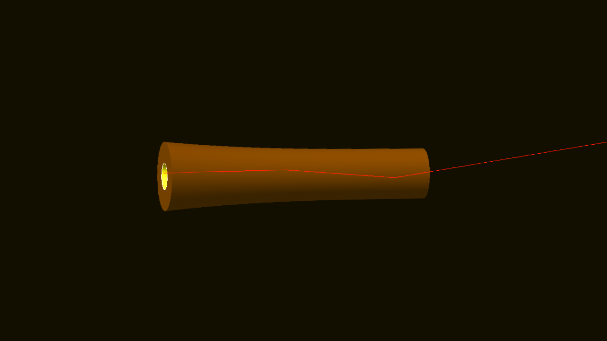

 </a>

<h3 align="center">Geant4 Tapered Capillary Simulaton - CERN Summer Student Program 2023</h3>

 </a>
 </a>

---

 A comprehensive Geant4 simulation of conical, polynomial, and hyperbolic shaped beam tapering capillaries, with configurable capillary material, capillary shape, beam particle type, beam energy, beam position distribution and beam anglular spread. Options for visualization or batches, with ROOT ntuple outputs. 
      

## Table of Contents

- [About](#about)
- [Simulation](#simulation)
    - [Visualisation](#visualization)
    - [Batch](#batch)
- [Analysis](#analysis)
- [Additional Notes](#notes)
- [Built Using](#built_using)
- [Authors](#authors)
- [Acknowledgements](#acknowledgements)

## About 

Write about 1-2 paragraphs describing the purpose of your project.

## Simulation 

### Visualization 

Add notes about how to use the system.

### Batch 

Add notes about how to use the system.

## Analysis 

## Additional Notes 

Add additional notes about how to deploy this on a live system.

## Built Using 
-  [Geant4](https://geant4.cern.ch/) - Simulation Framework 
-  [ROOT](https://root.cern/) - Data Framework 
-  [Matplotlib](https://matplotlib.org/) - Plotting 
-  [NumPy](https://numpy.org/) - Data Analysis  

## Authors 
- Dean Ciarniello [The University of British Columbia] [@deanciarniello](https://github.com/deanciarniello)

## Acknowledgements 

- CERN Summer Student Program
- Dr. Massimo Giovannozzi [CERN]
